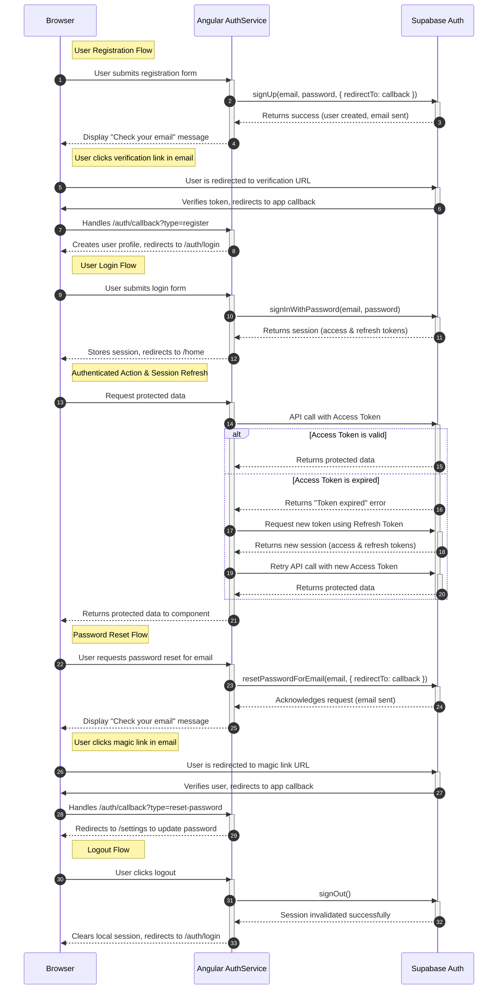

<authentication_analysis>

### 1. Authentication Flows

Based on the `auth-spec.md` document, the following authentication flows are defined:

*   **User Registration (with Email Verification):** A new user signs up, receives a verification email, and clicks a link to confirm their account before they can log in.
*   **User Login:** An existing user provides their credentials (email and password) to gain access to the application.
*   **User Logout:** An authenticated user signs out, terminating their session.
*   **Password Recovery:** A user who has forgotten their password can request a reset link via email. Clicking the link allows them to access a secure page to set a new password.

### 2. Actors and Interactions

*   **Browser:** The client-side environment where the user interacts with the Angular application. It initiates all authentication requests.
*   **Angular AuthService:** A service within the Angular application responsible for encapsulating authentication logic and communicating with the Supabase backend.
*   **Supabase Auth:** The backend-as-a-service provider that handles user management, credential verification, session management (JWTs), and sending transactional emails (e.g., verification, password reset).

### 3. Token Verification and Refresh

*   **Initial Authentication:** Upon successful login, Supabase Auth issues an access token and a refresh token. The Supabase client library stores these securely in the browser.
*   **Authenticated Requests:** For subsequent requests to protected resources, the access token is sent in the Authorization header.
*   **Token Expiration & Refresh:** When the access token expires, the Supabase client library automatically uses the refresh token to request a new access token from Supabase Auth without interrupting the user. If the refresh token is also invalid or expired, the user is logged out and must re-authenticate. This process is transparent to the user.

### 4. Authentication Steps Description

*   **Registration:** The user submits their details. `AuthService` calls Supabase `signUp`. Supabase sends a confirmation email and the user is redirected to a callback URL upon clicking the link to verify their account.
*   **Login:** The user submits credentials. `AuthService` calls Supabase `signInWithPassword`. On success, Supabase returns a session (including tokens), which the client library stores, and the user is redirected to the home page.
*   **Logout:** `AuthService` calls Supabase `signOut`. The client library clears the stored session, and the user is redirected to the login page.
*   **Password Recovery:** The user requests a password reset. `AuthService` calls Supabase `resetPasswordForEmail`. The user receives a magic link. Clicking it validates their session via a callback and redirects them to a settings page to update their password.

</authentication_analysis>

<mermaid_diagram>

</mermaid_diagram>
