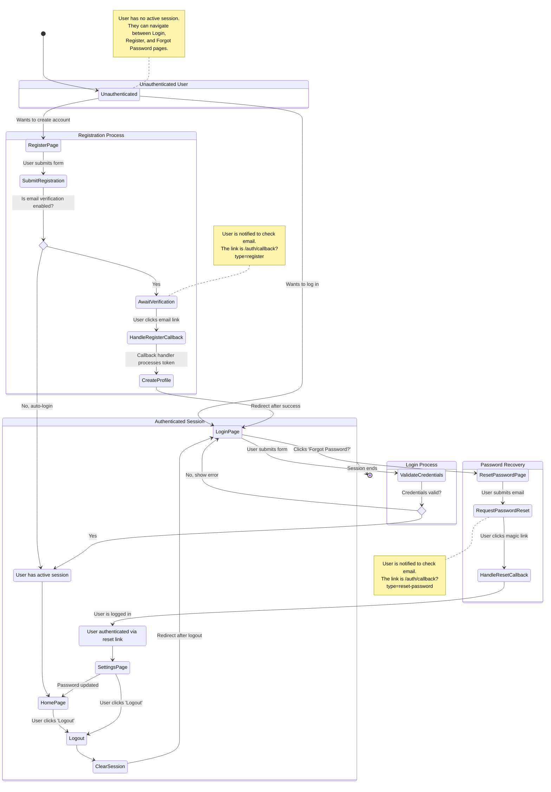

# User Journey Diagram for Authentication

This document contains a Mermaid diagram that visualizes the user flows for registration, login, and password recovery based on the specifications.

<mermaid_diagram>

</mermaid_diagram> 
