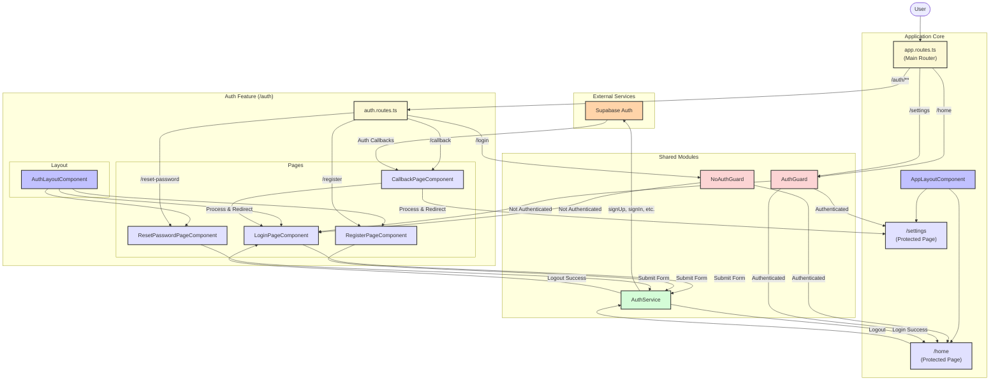

<architecture_analysis>

1.  **Component & Page Listing**:
    *   **Page Components**:
        *   `LoginPageComponent`
        *   `RegisterPageComponent`
        *   `ResetPasswordPageComponent`
        *   `CallbackPageComponent`
    *   **Layout Components**:
        *   `AuthLayoutComponent` (specific to the auth feature)
        *   `AppLayoutComponent` (for the main application, outside auth)
    *   **Shared Services**:
        *   `AuthService`
    *   **Routing Guards**:
        *   `AuthGuard`
        *   `NoAuthGuard`

2.  **Main Pages and Their Components**:
    *   **/auth/login**: `LoginPageComponent` wrapped in `AuthLayoutComponent`.
    *   **/auth/register**: `RegisterPageComponent` wrapped in `AuthLayoutComponent`.
    *   **/auth/reset-password**: `ResetPasswordPageComponent` wrapped in `AuthLayoutComponent`.
    *   **/auth/callback**: `CallbackPageComponent` (no visual layout, handles logic and redirection).
    *   **/home** (Protected Page): Requires `AuthGuard`, uses `AppLayoutComponent`.
    *   **/settings** (Protected Page): Requires `AuthGuard`, uses `AppLayoutComponent`.

3.  **Data Flow**:
    *   **User Input**: The Page Components (`Login`, `Register`, `Forgot Password`) collect user data through reactive forms.
    *   **Service Interaction**: These components call methods on the `AuthService` (`login`, `register`, `resetPassword`).
    *   **Backend Communication**: `AuthService` interacts with the Supabase backend for all authentication operations.
    *   **State Management**: `AuthService` and the Supabase client manage the user's session state (e.g., storing tokens).
    *   **Redirection**:
        *   Guards (`AuthGuard`, `NoAuthGuard`) redirect users based on their authentication status.
        *   `AuthService` methods redirect on success/failure (e.g., to `/home` after login, to `/auth/login` after logout).
        *   `CallbackPageComponent` handles logic from Supabase redirects and then navigates the user to the appropriate next page (`/auth/login` or `/settings`).

4.  **Component Functionality Description**:
    *   `LoginPageComponent`: Displays a form for users to enter their email and password. On submission, it calls `AuthService.login()`.
    *   `RegisterPageComponent`: Provides a registration form (email, password, confirm password). On submission, it calls `AuthService.register()`.
    *   `ResetPasswordPageComponent`: Shows a form for the user to enter their email to request a password reset link. Calls `AuthService.resetPassword()`.
    *   `CallbackPageComponent`: A transient component that activates upon redirection from Supabase after actions like email verification or password reset. It processes the callback, potentially interacts with `AuthService`, and redirects the user to the final destination.
    *   `AuthLayoutComponent`: A shared visual wrapper for the auth pages, providing a consistent look and feel (e.g., a centered card) and navigation links between login, register, and forgot password pages.
    *   `AuthService`: A singleton service that encapsulates all logic for communicating with the Supabase authentication backend. It manages sign-up, sign-in, sign-out, and password reset flows.
    *   `AuthGuard`: A route guard that prevents unauthenticated users from accessing protected parts of the application.
    *   `NoAuthGuard`: A route guard that prevents authenticated users from accessing the authentication pages (login, register), redirecting them to the main app dashboard instead.

</architecture_analysis>

<mermaid_diagram>

</mermaid_diagram> 
