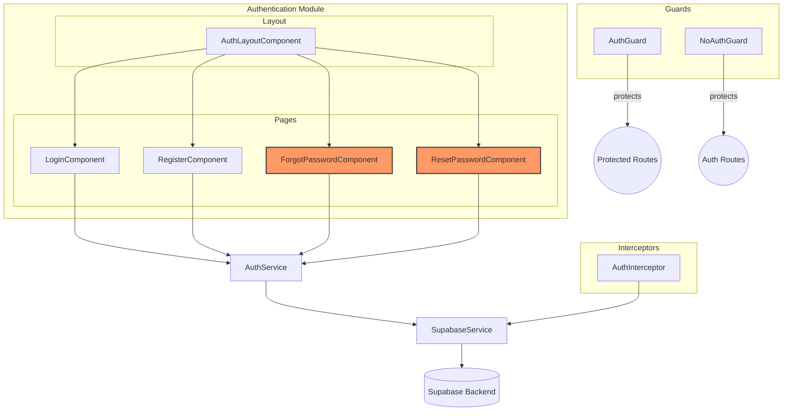

<architecture_analysis>
1. Components:
   - AuthLayoutComponent (shared layout for authentication pages)
   - LoginComponent
   - RegisterComponent
   - ForgotPasswordComponent
   - ResetPasswordComponent
   - AuthService (wraps Supabase auth calls)
   - SupabaseService (client integration with Supabase backend)
   - AuthGuard (protects routes requiring authentication)
   - NoAuthGuard (blocks authenticated users from auth routes)
   - AuthInterceptor (attaches auth token to outgoing HTTP requests)
   - Auth models: AuthRequest, AuthResponse, ErrorResponse

2. Main pages and corresponding components:
   - Login page: LoginComponent (path '/auth/login')
   - Registration page: RegisterComponent (path '/auth/register')
   - Forgot Password page: ForgotPasswordComponent (path '/auth/forgot-password')
   - Reset Password page: ResetPasswordComponent (path '/auth/reset-password/:token')
   - All pages are rendered within AuthLayoutComponent

3. Data flow:
   - User interacts with a page component entering data in a reactive form
   - Page component calls AuthService to perform auth operations
   - AuthService delegates calls to SupabaseService which communicates with the Supabase backend
   - Supabase responds with session/token or error which is mapped by AuthService
   - Page component handles success (navigation/snackbar) or displays error messages
   - AuthInterceptor retrieves the token via SupabaseService to attach to HTTP requests
   - AuthGuard and NoAuthGuard enforce routing logic based on the active session

4. Component functionality:
   - AuthLayoutComponent: centers Material card, provides links to auth pages
   - LoginComponent: collects email/password, calls AuthService.login()
   - RegisterComponent: collects email/password/confirmPassword, calls AuthService.register()
   - ForgotPasswordComponent: collects email, calls AuthService.requestPasswordRecovery()
   - ResetPasswordComponent: collects newPassword/confirmPassword, extracts token, calls AuthService.resetPassword()
   - AuthService: handles client-side validation, invokes Supabase, maps errors
   - SupabaseService: low-level client for auth API calls
   - AuthGuard: checks session and redirects unauthenticated users
   - NoAuthGuard: redirects authenticated users away from auth routes
   - AuthInterceptor: appends Authorization header with bearer token
</architecture_analysis>

<mermaid_diagram>

</mermaid_diagram> 
